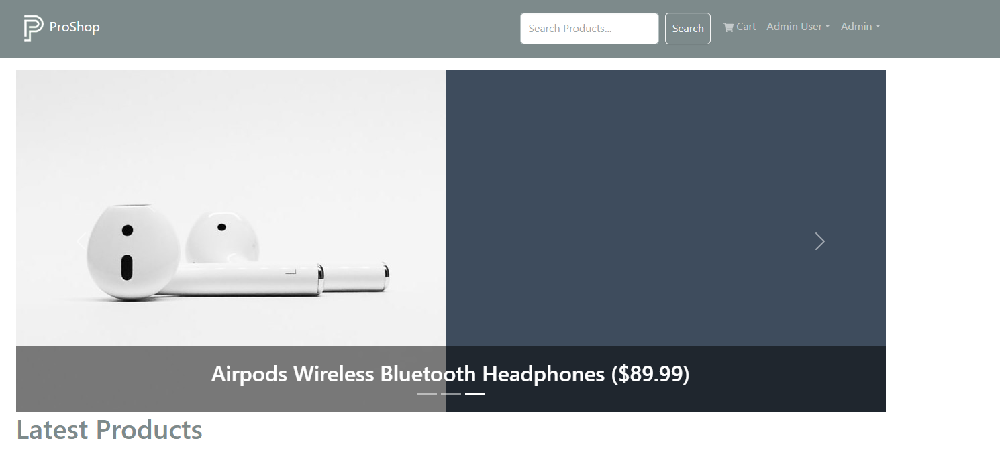
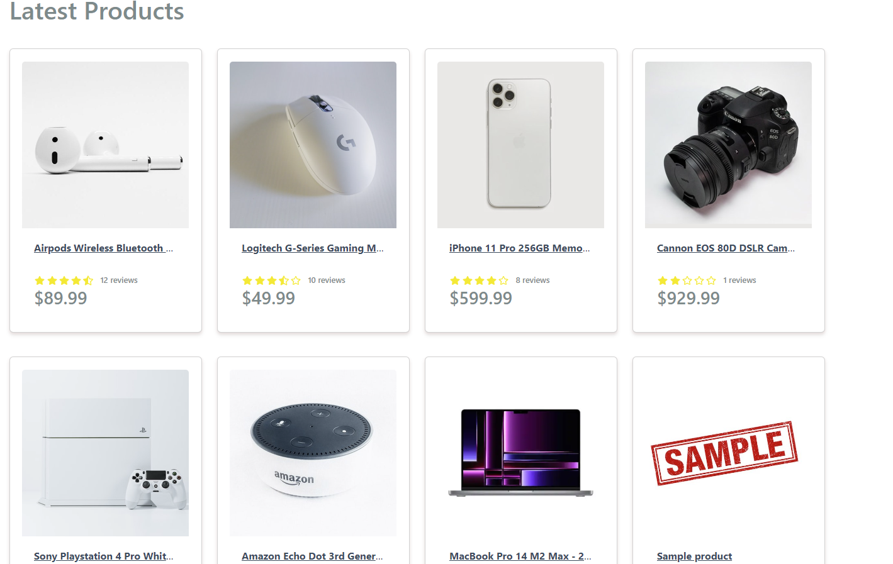
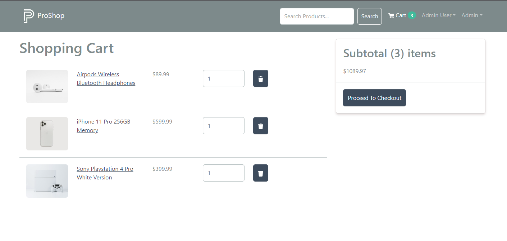
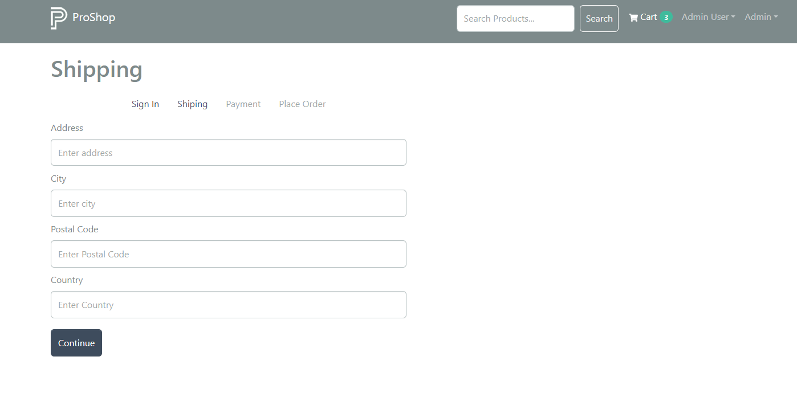
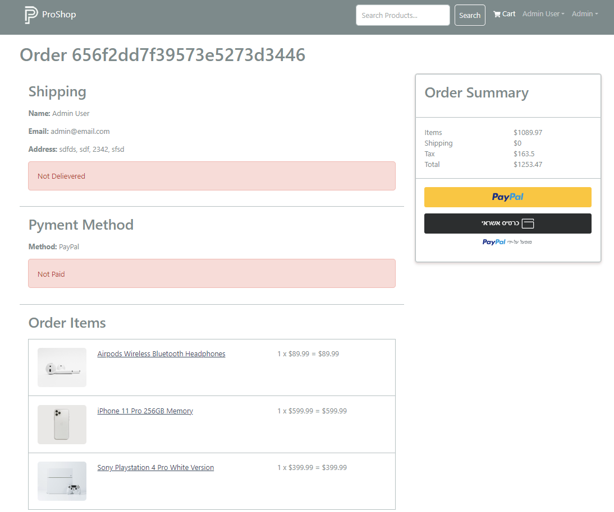
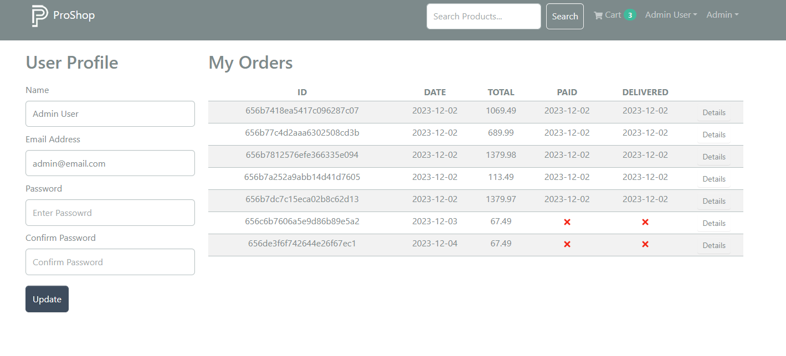
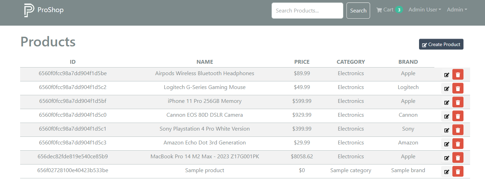
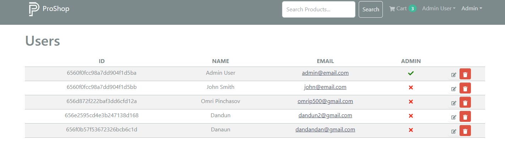
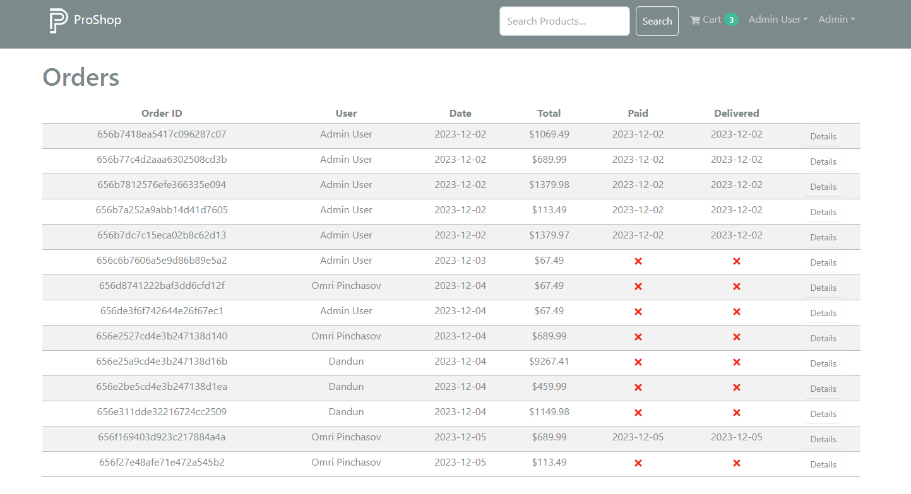

# ProShop

## Description

ProShop is your go-to e-commerce destination, dedicated to offering a diverse array of cutting-edge electronic products. Dive into a world of innovation and quality, where your tech needs meet exceptional shopping experiences.

## Deployment

The application is deployed at [https://www.omrishop.com/](https://www.omrishop.com/).

## Features

- **User Registration:** Seamlessly create an account to unlock personalized shopping benefits.
- **User Login:** Securely access your account for a tailored shopping journey.
- **Hot Products Carousel:** Stay in the loop with a dynamic carousel showcasing the latest and most popular items.
- **Product Search:** Easily find your desired products using the intuitive search box.
- **Quick Product Access:** Jump straight to a specific product from the homepage for efficient browsing.
- **Shopping Cart Management:**
  - Add items to your cart with just a few clicks, including quantity selection.
  - View and navigate your shopping cart effortlessly.
  - Modify quantities and remove items for a customized shopping experience.
- **Address Form Completion:** Streamline the checkout process with a user-friendly address form.
- **Place Order:** Easily complete your purchase, choosing between payment options such as PayPal (sandbox) or credit card.
- **Order Status Tracking:** Keep tabs on your order with real-time updates on payment and shipment status.
- **User Profile:** Access and update your user profile, and view your order history for added convenience.

## Admin Panel Features

- **Product Management:**
  - Edit, delete, and add new products to keep your inventory up-to-date.
- **User Management:**
  - View and manage existing users, including the ability to delete or edit user details.
  - Admin privileges: Grant admin access to selected users for enhanced control.
- **Order Management:**
  - View orders and update order status to "Shipped" for efficient order tracking.

## Key Technologies

- **MongoDB:** A robust and scalable NoSQL database for efficient data management.
- **Express.js:** A fast and minimalist web application framework for Node.js.
- **React:** A powerful JavaScript library for building user interfaces.
- **Node.js:** An open-source, cross-platform JavaScript runtime environment.
- **Redux:** A predictable state container for managing the application's state.
- **React-Bootstrap:** A front-end framework for developing responsive and mobile-first applications.
- **JWT (JSON Web Tokens):** A secure and compact way to transmit information between parties.

## Environment Variables

NODE_ENV=development
PORT=5000
MONGO_URI=YOUR_MONGO_URI
JWT_SECRET=YOUR_JWT_SECRET
PAYPAL_CLIENT_ID=YOUR_PAYPAL_CLIENT_ID
PAGINATION_LIMIT=8
PAYPAL_APP_SECRET=YOUR_PAYPAL_APP_SECRET
PAYPAL_API_URL=YOUR_PAYPAL_APP_URI

## Install Dependencies (frontend & backend)

```bash
npm install
cd frontend
npm install
```

## Run

```bash
# Run frontend (:3000) & backend (:5000)
npm run dev

# Run backend only
npm run server
```

## Screenshots


_Home Screen_


_Home Screen_


_Shopping Cart_


_Shiping Form_


_Purchase Page_


_User Profile Page_


_Admin Panel - Products_


Admin Panel - Users


_Admin Panel - Orders_
